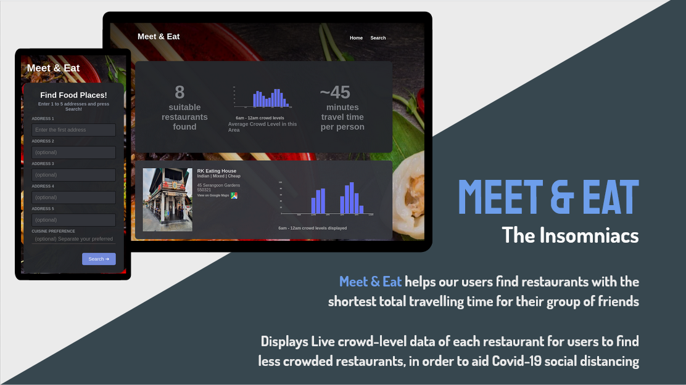

# Meet & Eat - NUS Hack & Roll
- This project was submitted in a 24-hour hackathon, in collaboration with Lee Yu Hao and Richard Ng from Singapore Management University
- This README is based on the write-up by Richard over here: https://devpost.com/software/team-unfv54

<!---

-->

### Inspiration

We have on many occasions faced difficulty in **settling on a fair location for a group meetup given that we reside in different parts of Singapore**. This often leads to some members of the group having travel times much longer than necessary. In the context of fighting **COVID-19**, there is also newfound importance in **practicing social distancing** when eating out. We were unable to find any web service that takes in multiple starting addresses and returns the optimal restaurants based on travel time and crowd avoidance, so we decided to create one!

### What it does
With the inputted addresses, Meet & Eat will first find the **geographic midpoint** by converting the addresses to latitude longitude coordinates through the **Google Maps Geocoding API**. However, this midpoint could end up in an unpractical location such as within a reservoir or in a place devoid of restaurants.

To meaningfully overcome this issue, we needed a creative solution involving a lot of data and converting it into something useful. We **scraped for over 1300 restaurants** in Singapore and their cuisines. This data was expanded to include the restaurants’ address, the main photo, and geographic coordinates through the Google Maps Details API. The sizable number of restaurants coordinates were used as the unlabeled dataset for **unsupervised machine learning** to generate 50 clusters of restaurants using **k-means clustering**. Each cluster is a meaningful vicinity for users to explore for good restaurants. Meet & Eat then finds the closest 4 centroids of restaurants to the users’ geographic midpoint.

However, the most geographically central location does not account for public transport infrastructure and travel time. This is why we narrowed down to 4 of the closest centroids to then calculate the sum of travel times from the users’ addresses to each centroid, using the **Google Maps Distance Matrix API**. The centroid with the **smallest travel time sum** is selected. Users will then be presented with the list of restaurants from that centroid and provided with meaningful information such as the **restaurant’s crowd level** throughout the day. This is particularly useful in the context of COVID-19, allowing users to pick from uncrowded restaurants and timings to better practice safe social distancing. Users are also provided with **numerical and graphic statistics of the search, the restaurants’ cuisines and picture, and a link to the restaurant’s google maps search result**.

### How we built it
We used an extensive technology stack to develop the Meet & Eat webservice. **Python/Flask** was the ideal language for the backend given that our project dealt a lot with data. We made good use of python’s extensive libraries such as **scikit-learn** for machine learning, **BeautifulSoup** for web scraping and **plotly** for visualization. We also used different APIs and datasets in tandem to collect meaningful data. For instance, we retrieved restaurant details such as the geographic coordinates and photo by parsing the restaurant names that we scraped from the web to the **Google Maps Place Details API**. These details were then parsed into the **Best Time API** to retrieve forecasted crowd levels. The frontend portion of the project was constructed using **HTML, CSS and Javascript**.

### Challenges we ran into
Since the team was split into working on the frontend and backend respectively, one of the greatest challenges we faced was integrating the frontend and backend components of the project together without breaking the webservice. This was the first time anyone in the team used the Google Maps and Best Time API and a non-negligible amount of time was spent understanding the documentation to extract the necessary data for the webservice to function properly. Another first and consequence challenge for the team was deploying the project to a **live server using Heroku**.

### Accomplishments that we're proud of
The team is proud that we were able to integrate many different components of software development, from web scraping to machine learning and frontend design within the limited time window. We are also proud that we made a useful service that can serve a large audience since it solves common problems relevant to anyone wanting to eat out in a group. **Meet & Eat helps in both optimizing travel time and avoiding crowds**.

### What we learned
This project exposed the team to many new frameworks, tools, and nuances that we have never dabbled with before. This list includes web scraping using BeautifulSoup, extracting data from different APIs, doing unsupervised machine learning with scikit-learn, and discovering more CSS properties to use. The project also gave us a newfound appreciation for the value provided by each level of the product stack, and the importance or synergizing across the stack to produce a working product.

### What's next for Team
Extend Meet & Eat onto different platforms such as **dedicated iOS/Android applications** or as a **Telegram/Discord bot**. Deploy Meet & Eat onto a **dedicated server**.
